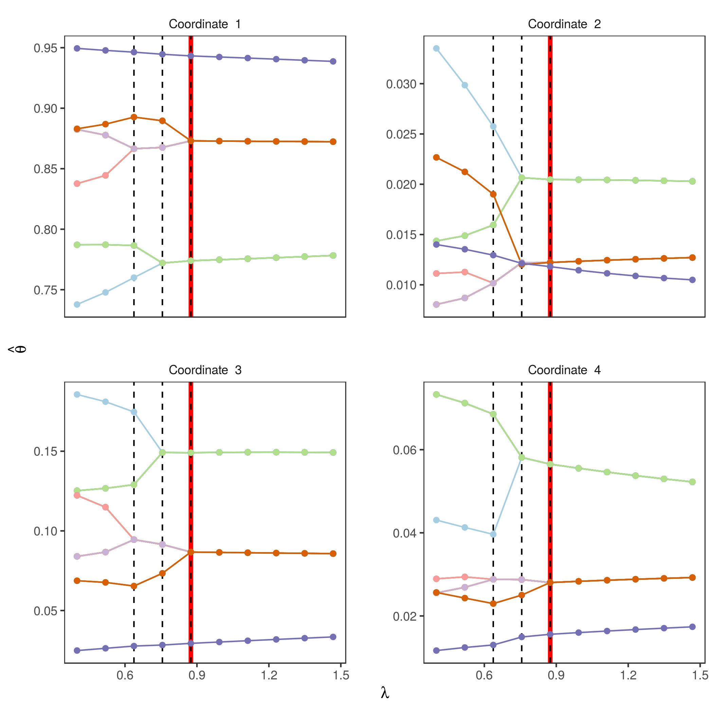
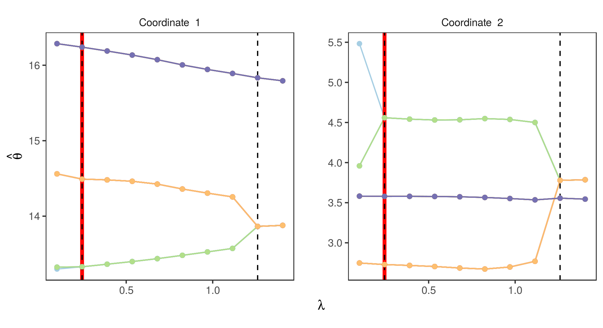
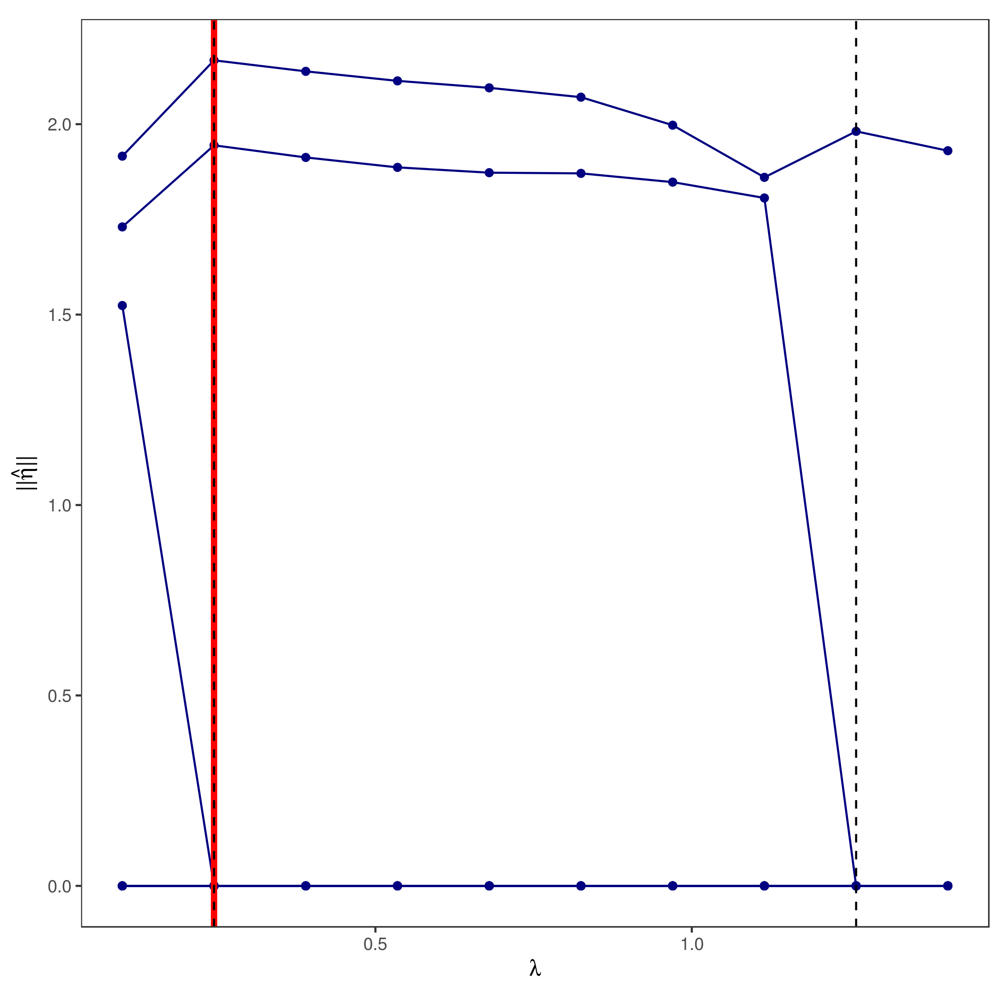

# GroupSortFuse
Implementation of the Group-Sort-Fuse (GSF) procedure in [2] for estimating the number of components in finite mixture models. Four families of mixture models are currently implemented:
 + `normalLocOrder`: Multidimensional Gaussian mixture models in location, with common but possibly unknown scale parameter;
 + `multinomialOrder`: Multinomial mixture models;
 + `poissonOrder`: Univariate Poisson mixture models;
 + `exponentialOrder`: Exponential distribution mixture models.

This package continues to be under development, and has only been tested on Ubuntu 16.04 with R  3.4.4. This release should not be considered stable. 

# Installation
This package may be installed as follows, using the `devtools` R package. If you do not have the `devtools`
package installed, you may install it using the command `install.package("devtools")`.
```r
library(devtools)
devtools::install_github("tmanole/GroupSortFuse")
```

# Examples
We provide two examples which were considered in [2]. 

## Example 1: Pollen Data
We consider the data analyzed by [3], arising from the study of the Bellas Artes pollen core from the Valley of Mexico. The
data consists of 100 counts on the frequency of occurrence of 4
kinds of fossil pollen grains, at 73 different levels of a pollen core. 
The data is available in the `MM` package, which can be installed
via the command `install.packages("MM")`. We load the data as follows.
```r
library(MM)
data(pollen)
```
A simple multinomial model provides a poor fit to this data, due to over-dispersion
caused by clumped sampling. We instead fit a multinomial mixture model using the GSF
with upper bound 12 on the number of components, and with a local linear approximation
of the SCAD penalty, as follows.
```r
require(GroupSortFuse)
set.seed(1) 
n   <- 73
fitGsf <- multinomialOrder(pollen, K=12, lambdas=seq(0.4, log(n) * n^(-0.25), penalty="SCAD-LLA")
```
The parameter `lambdas` specifies a sequence of tuning parameters at which the GSF is applied. The `fitGsf`
object contains the parameter estimates of the mixture at all values of this tuning parameter. For example, 
`out[[1]]$theta` is a matrix whose columns are the fitted multinomial probabilities (atoms) across components
of the mixture, for the first value 0.4 of the tuning parameter. Also, `out[[1]]$K` indicates the number of unique columns in `out[[1]]$theta`, which is the fitted number of components for the first tuning parameter.
We can visualize the evolution of the mixture atom estimates as a function of the tuning parameter using the `gsf` object plotting method:

```r 
# install.packages("ggplot2")
plot(fitGsf, gg=T, eta=F, vlines=T)
```


For a plot in Base R graphics (as opposed to a `ggplot2` plot), simply run the above plotting function with parameter `gg=F`.

For applications where a specific number of mixture components is required, the Bayesian Information Criterion or v-fold cross validation can be used to select a tuning parameter, as shown in the following example.

```r
tuning <- bicTuning(fitGsf, pollen)
```

The selected tuning parameter is `tuning$result$lambda`, and the corresponding number of components is 
`tuning$result$K`, which turns out to be 3 in this example. We can add this to the coefficient plots from before, as follows

```r
plot(fitGsf, gg=T, eta=F, vlines=T, opt=tuning$result$lambda)
```


Als available is a one-dimensional visualization of the norm of the differences of the sorted, fitted, atoms.

```r
plot(fitGsf, gg=T, eta=T, vlines=T, opt=tuning$result$lambda)
```


## Example 2: Seeds Data
We now consider the seeds data of [1],
in which 7 geometric parameters were measured by X-Ray in 210 seeds, belonging to
three different varieties. We fit the GSF on two of the gemoetric parameters of this data
with an upper bound 12 on the number of components. 

```r
y <- seeds[,c(2,6)]
n <- nrow(y)

set.seed(1)
outMCP      <- normalLocOrder(y, K=12, lambdas=seq(0.1, n^(-0.25) * log(n), length.out=10), arbSigma=T, verbose=F, penalty="MCP-LLA")

bicMCP  <- bicTuning(y, outMCP)

plot(outMCP, gg=T, eta=F, vlines=T, points=T, opt=bicMCP$result$lambda)
```



Furthermore, a one-dimensional visualization of the sorted atom difference norms is given as follows.

```r
plot(outMCP, gg=T, eta=T, vlines=T, points=T, opt=bicMCP$result$lambda)
```




# References 
[1] Charytanowicz, M., Niewczas, J., Kulczycki, P., Kowalski, P. A., Lukasik, S. and Zak, S. (2010. Complete Gradient Clustering Algorithm for Features Analysis of X-Ray Images. *Adv. Intell. Sof. Comput.* 69, 15-24.

[2] Manole, T. and Khalili, A. (2019). Estimating of the Number of Components in Finite Mixture Models via the Group-Sort-Fuse Procedure. *Submitted.*

[3] Mosimann, J. E. (1962). On the Compound Multinomial Distribution, the Multivariate Beta Distribution, and Correlations Among Proportions. *Biometrika* 49, 65-82.
